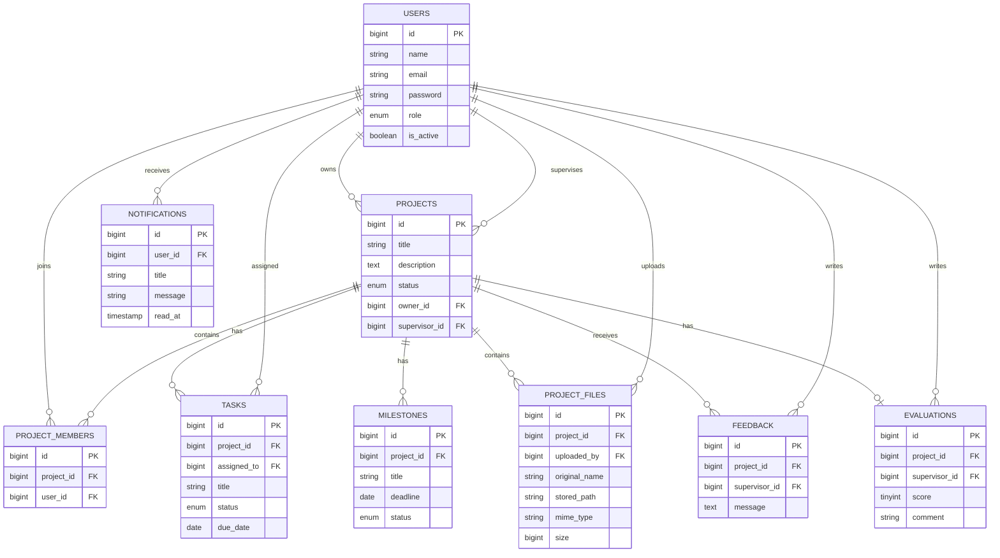

# ProjectHub — Implementation Plan V2.2

**Project Type:** Graduation Project Management Platform
**Stack:** Laravel + PHP + MySQL + Blade + Tailwind CSS + Alpine.js
**Development Time:** 14 Days (strict)
**Target:** Working MVP suitable for a graduation project demonstration
**Development Strategy:** MVP-first, strict scope control, no over-engineering

---

## 1. Project Overview

### 1.1 Project Name

ProjectHub

### 1.2 Project Description

ProjectHub is a web-based platform designed to help university students and supervisors manage graduation projects from the initial project idea through development, testing, and final submission.

The system centralizes:

- Project information
- Team members
- Tasks
- Milestones
- Project files
- Supervisor feedback
- Supervisor evaluation
- Project progress
- Project health

The goal is to replace scattered communication and file-sharing methods with one centralized project management platform.

---

## 2. Problem Statement

Graduation project teams often rely on different tools for different activities:

- WhatsApp for communication
- Google Drive for files
- Paper or spreadsheets for tasks
- Email for supervisor feedback
- Manual progress tracking

This creates several problems:

- Project information becomes scattered.
- Students may lose track of deadlines.
- Supervisors have difficulty monitoring multiple projects.
- Feedback can become difficult to track.
- Project progress is not clearly visible.
- There is no simple, single place to record a supervisor's evaluation of a project.

ProjectHub provides one centralized system for managing these activities.

---

## 3. Goals

1. Provide a centralized graduation project management platform.
2. Allow students to manage project teams.
3. Allow teams to manage project tasks.
4. Track project milestones.
5. Calculate project progress automatically.
6. Allow secure project file management.
7. Allow supervisors to review projects, provide feedback, and record a simple evaluation.
8. Provide a simple Project Health indicator.
9. Provide a clear, controlled Project Status workflow.
10. Provide administrators with basic system management.
11. Demonstrate practical Laravel Full-Stack development skills.

---

## 4. Target Users

The system has exactly **three roles**: Student, Supervisor, Admin. No other role exists or is planned.

### 4.1 Student

A university student who participates in a graduation project.

Students can:

- Create a project (only if they don't already belong to one — Section 13).
- Manage their team (if project owner).
- Create and manage tasks.
- Track milestones.
- Upload project files.
- View supervisor feedback.
- View supervisor evaluation.
- View project progress.
- View project health.

### 4.2 Supervisor

A university supervisor responsible for supervising one or more projects.

Supervisors can:

- View assigned projects only.
- Monitor project progress.
- View team members.
- View tasks.
- View milestones.
- Review project files.
- Upload project files to assigned projects.
- Add feedback.
- Submit/update the project evaluation (score + optional comment).
- **Change the Project Status of assigned projects** (see Section 11).
- Monitor overdue tasks.
- View project health.

Outside of feedback, evaluation, file uploads, and status changes, the Supervisor role remains **read-only** — supervisors do not edit project details, team membership, tasks, or milestones.

### 4.3 Admin

The administrator manages the platform.

Admins can:

- Manage users.
- Activate/deactivate users.
- Assign supervisors.
- View all projects.
- Change the status of any project.
- View basic statistics.

---

## 5. Scope Strategy

### 5.1 MUST HAVE (required for the MVP)

1. Authentication
2. Roles and Authorization
3. Project Management (including Status Workflow)
4. Team Management
5. Task Management
6. Milestones
7. Automatic Progress Calculation
8. Project Files
9. Supervisor Feedback
10. Simple Evaluation System
11. Project Health
12. Student Dashboard
13. Supervisor Dashboard
14. Admin Dashboard
15. Basic Admin Management

None of these may be removed or skipped.

### 5.2 SHOULD HAVE / OPTIONAL

These are **not** part of the core 14-day MVP. They are only attempted if the entire MUST HAVE list above is already complete and stable, and only implemented after that point — never in parallel with it:

- Search
- Filters
- Database Notifications

If there is not enough time, these features are simply skipped. **The project is still considered complete without them.**

### 5.3 FUTURE (explicitly outside the 14-day MVP)

- Real-time notifications
- Email notifications
- Chat
- AI project analysis
- AI code review
- GitHub integration
- File versioning
- S3/cloud storage
- Public API
- Two-factor authentication
- Audit logs
- Virus scanning
- Weighted progress calculations
- Multiple simultaneous project memberships
- Supervisor request system
- Advanced/full-text search
- Multi-criteria/rubric-based evaluation (the MVP evaluation stays a single score + optional comment)

None of these items may be moved into MUST HAVE or SHOULD HAVE.

---

## 6. MVP Features

The final MVP contains exactly these modules:

1. Authentication
2. Role Management
3. Project Management + Status Workflow
4. Team Management
5. Task Management
6. Milestones
7. Progress Calculation
8. Project Health
9. File Management
10. Supervisor Feedback
11. Simple Evaluation System
12. Student Dashboard
13. Supervisor Dashboard
14. Admin Dashboard
15. Basic Admin Management

Search, Filters, and Notifications are **not** in this list — they are SHOULD HAVE / OPTIONAL only (Section 5.2).

---

## 7. Authentication

### 7.1 Student Registration

Students self-register using:

- Name
- Email
- Password
- Password confirmation

New self-registered accounts receive:

```
role = student
is_active = true
```

Supervisors and administrators are **not** publicly self-registered. They are created by the Admin only.

### 7.2 Login

All users log in using email + password. After login, users are redirected according to their role:

```
Student     → Student Dashboard
Supervisor  → Supervisor Dashboard
Admin       → Admin Dashboard
```

### 7.3 Logout

All authenticated users can log out.

---

## 8. Roles

The system has exactly three roles, stored on `users.role`:

```
student
supervisor
admin
```

There is **no** Team Leader role and **no** additional role of any kind. Project ownership is represented purely by `projects.owner_id` (see Section 10 and Section 24) — it is not a system role.

---

## 9. Authorization Matrix

"Own" = the student is a member of that project (`project_members`). "Owner" = the student referenced by `projects.owner_id`. "Assigned" = the supervisor referenced by `projects.supervisor_id`.

| Feature | Student | Supervisor | Admin |
|---|---|---|---|
| Register | Yes (self) | No | No |
| Login | Yes | Yes | Yes |
| Create Project | Yes, only if not already in a project (Section 13) | No | Optional |
| View Project | Own (member) | Assigned | All |
| Edit Project (title/description) | Owner only | No | Yes |
| **Change Project Status** | No | **Assigned only** | Yes |
| Add Team Member | Owner only | No | Yes |
| Remove Team Member | Owner only | No | Yes |
| Create Task | Owner only | No | Yes |
| Assign Task | Owner only | No | Yes |
| Update Assigned Task Status | Assignee or Owner | No | Yes |
| View Tasks | Own project | Assigned project | All |
| View Milestones | Own project | Assigned project | All |
| Update Milestones | Owner only | No | Yes |
| Upload File | Own project members | Assigned project | Yes |
| Download File | Own project members | Assigned project | Yes |
| Delete File | Uploader or Owner | No | Yes |
| Add Feedback | No | Assigned project only | Yes (optional) |
| View Feedback | Own project | Assigned project | Yes |
| **Submit/Update Evaluation** | No | **Assigned only** | Yes (optional) |
| **View Evaluation** | Own project (read-only) | Assigned project | Yes |
| View Project Health | Own project | Assigned project | Yes |
| Manage Users | No | No | Yes |
| Activate/Deactivate Users | No | No | Yes |
| Assign Supervisor | No | No | Yes |
| View All Projects | No | No | Yes |
| View Statistics | No | No | Yes |

Note: title/description editing stays Owner-only, but **status changes are handled separately** by the Supervisor (assigned) or Admin, never by the student — see Section 11 for the full rationale and transition rules.

All authorization checks above must be enforced **server-side** (Policies/middleware), never only by hiding UI elements.

---

## 10. Project Management

### 10.1 Project Fields

- ID
- Title
- Description
- Status
- **owner_id** (single source of truth for project ownership — see Section 24)
- supervisor_id (nullable)
- Created date
- Updated date

### 10.2 Project Status Values

```
Planning
Analysis
Development
Testing
Completed
```

### 10.3 Project Rules

- A student can own only one active project (`projects.owner_id`).
- A student can belong to only one project at a time — see Section 13 for how this is strictly enforced.
- A project may have between **1 and 5** members (see Section 12).
- A project has at most one supervisor.
- A project starts with status `Planning`.
- Default milestones are automatically created when a project is created.
- The creating student is automatically set as `projects.owner_id` **and** automatically added as a row in `project_members` in the same operation.
- Status changes follow the structured workflow defined in Section 11 — the student owner cannot change status directly.

---

## 11. Project Status Workflow

This section defines exactly who can change a project's status and which transitions are allowed. It replaces any implicit or ad-hoc status-editing behavior.

### 11.1 Who Can Change Status

| Role | Can change status? | Scope |
|---|---|---|
| Student (owner) | **No** | Students never change status directly — they drive status change indirectly by completing work and requesting supervisor review |
| Supervisor | **Yes** | Only for projects where `projects.supervisor_id` matches them (assigned projects) |
| Admin | **Yes** | Any project |

This is a deliberate change from earlier plan drafts: giving status-change authority to the Supervisor (and Admin) — not the student — keeps status meaningful as a supervised checkpoint, rather than a self-reported field the owner can set arbitrarily.

### 11.2 Allowed Transitions

Status moves forward through a fixed sequence. Backward moves are allowed only one step, to correct a premature advance — no arbitrary jumps in either direction.

```
Planning → Analysis
Analysis → Development
Development → Testing
Testing → Completed
```

**Backward (correction) transitions**, also restricted to Supervisor/Admin:

```
Analysis → Planning
Development → Analysis
Testing → Development
Completed → Testing
```

**Not allowed:** skipping a stage (e.g. `Planning → Development`) and jumping more than one step backward (e.g. `Testing → Planning`). If a project genuinely needs to skip stages, the Supervisor/Admin advances it one transition at a time — this keeps the rule simple and avoids building a configurable state machine.

### 11.3 Effect of Status

- Reaching `Completed` makes Project Health always display **Good**, regardless of overdue tasks (Section 17).
- No other status has a special side effect in the MVP — progress and health continue to be computed from tasks as usual for all other statuses.

### 11.4 Where This Is Implemented

- `ProjectPolicy::changeStatus()` — checks the actor is the assigned supervisor or an admin, and that the requested transition is in the allowed list (Section 11.2).
- A single `PATCH /projects/{id}/status` route (or supervisor/admin-namespaced equivalent) handles the change; there is no separate status-editing endpoint per role.

---

## 12. Team Management

### 12.1 Team Size

```
Minimum at creation: 1 (the owner)
Maximum: 5
```

The project owner is automatically added as the first member the moment the project is created. **Project creation is never blocked by having only one member** — a project with just the owner is valid and normal at the start. The system should encourage growing the team to 2–5 members over time, but this is guidance, not a hard gate.

### 12.2 Project Owner

The project owner is identified by `projects.owner_id` — this is the **only** source of truth for ownership (see Section 24). There is no separate "owner" flag anywhere else.

Only the owner can:

- Edit project title/description.
- Add team members.
- Remove team members.
- Create tasks.
- Assign tasks.
- Manage milestones.

The owner does **not** control project status — that belongs to the assigned Supervisor/Admin (Section 11).

### 12.3 Adding Members

The owner searches registered students by name or email. Before adding a student, the system checks:

- Student exists and has role = student.
- Student is not already a member of **this** project.
- Student does not already belong to **any other** project (Section 13 — strictly enforced).
- Team size has not reached 5.

No invitation/acceptance system is implemented in the MVP — the owner adds members directly.

---

## 13. Student Project Membership Rule (Strictly Enforced)

**Rule:** A student can belong to only **one** project at a time — as either the owner or a plain member. This is one of the most important integrity rules in ProjectHub and is protected at multiple layers, not just one.

### 13.1 Why a Single Database Constraint Is Not Enough

`project_members` carries `unique(project_id, user_id)`. This constraint only prevents a student from being added **twice to the same project** — it does nothing to stop the same student from being added to a **second, different** project. Relying on this constraint alone would silently allow multi-project membership, contradicting the rule. The rule must therefore be enforced explicitly, in application code, every time membership changes.

### 13.2 Enforcement Layers

1. **Form Request validation** (`AddTeamMemberRequest` and project-creation logic): a custom validation rule checks — *before* any database write — whether the target student already has a row in `project_members` for any project. If yes, validation fails with a clear error ("This student already belongs to a project").
2. **Application/service-level check inside a database transaction:** the same existence check is re-run immediately before the `project_members` insert, wrapped in a transaction, to close the race-condition window between validation and write (two simultaneous add-member requests for the same student).
3. **Applies uniformly to every entry point** that can create membership: project creation (the owner becomes a member), the "add team member" action, and any admin-side member-add if implemented. There is only one membership-check routine, reused everywhere, so the rule cannot be bypassed by using a different code path.
4. **No separate membership-status table or soft states** (e.g. "pending"/"invited") are introduced to support this — the check is a simple, single existence query: *"does `project_members` already contain a row for this `user_id`, for any project?"*

### 13.3 What This Rule Does NOT Require

- No changes to the database schema beyond what Section 26 already defines.
- No membership-request/approval workflow.
- No per-user "current project" cache column — the check queries `project_members` directly, so there is only one source of truth and nothing to keep in sync.

---

## 14. Task Management

### 14.1 Task Fields

- ID
- Project ID
- Title
- Description
- Assigned user
- Status
- Due date
- Created date
- Updated date

### 14.2 Task Status

```
Pending
In Progress
Completed
```

### 14.3 Task Rules

The project owner (`projects.owner_id`) can create, assign, edit, and delete tasks. The assigned student can view their task and update its status. The owner can also update any task's status.

### 14.4 Overdue Tasks

```
due_date < current_date
AND status != Completed
```

Overdue task counts feed directly into the Project Health calculation (Section 17).

---

## 15. Milestones

Every project is created with six default milestones:

1. Idea
2. Proposal
3. Analysis
4. Development
5. Testing
6. Final Submission

### 15.1 Milestone Fields

- ID
- Project ID
- Title
- Description
- Deadline
- Status
- Created date
- Updated date

### 15.2 Milestone Status

```
Pending
In Progress
Completed
```

### 15.3 MVP Rules

Milestones are created automatically (6 defaults) when the project is created. The owner can update milestone status and deadlines. Creating additional custom milestones beyond the default six is **FUTURE** functionality, not MVP.

---

## 16. Progress Calculation

### Formula

```
Progress = Completed Tasks / Total Tasks × 100
```

**Example:** 10 total tasks, 6 completed → Progress = 60%.

### No Tasks

```
If Total Tasks = 0 → Progress = 0%
```

### Display

Shown as a percentage plus a progress bar, e.g.:

```
████████░░ 80%
```

Milestone status does **not** affect the percentage in the MVP. Weighted progress (tasks + milestones combined) is FUTURE functionality.

---

## 17. Project Health

Project Health is the signature "smart-looking" feature of ProjectHub. It is a **required MUST HAVE** feature and is not removed. It uses simple business rules only — no AI, no machine learning, no weighted scoring.

### States

```
Good
Needs Attention
Critical
```

### Rules

```
IF overdue_tasks >= 3
    → Critical

ELSE IF overdue_tasks >= 1
    → Needs Attention

ELSE
    → Good
```

If `projects.status = Completed`, health is always **Good**, overriding the rules above.

### Why This Feature Exists

Project Health gives a quick, explainable overview of project condition without requiring AI or complex analytics. It is easy to implement, test, explain, and demonstrate live — which is exactly why it stays simple by design rather than being expanded.

---

## 18. File Management

### 18.1 Supported File Types (MVP — final)

```
PDF
DOC
DOCX
JPG
JPEG
PNG
```

ZIP is **not** included in the MVP.

### 18.2 Maximum File Size

```
10 MB per file
```

### 18.3 File Fields

- ID
- Project ID
- Uploaded by
- Original name
- Stored path
- MIME type
- File size
- Created date

### 18.4 File Permissions

- Project members can upload and download files.
- The uploader or the project owner can delete files.
- The assigned supervisor can view/download files and upload files to the project.
- Admin can view/download/delete all files.

### 18.5 File Security

Files are stored **privately**, not in a publicly-guessable location. Every download request passes through an authorized Laravel route/controller that verifies the current user is permitted to access that project (member, assigned supervisor, or admin) **before** the file is served. Files are never exposed through unrestricted public URLs. Upload validation checks extension, MIME type, and file size.

---

## 19. Supervisor Feedback

### Feedback Fields

- ID
- Project ID
- Supervisor ID
- Message
- Created date
- Updated date

### Supervisor Can

View project, files, tasks, milestones, and progress for **assigned** projects only; add feedback to assigned projects.

### Students Can

View feedback left on their own project (read-only).

Feedback replies/threads are FUTURE functionality — not part of the MVP. Feedback remains a free-text, ongoing commentary channel, distinct from the one-time/updatable structured Evaluation described next.

---

## 20. Simple Evaluation System

A lightweight, structured evaluation feature, distinct from free-text Feedback (Section 19). This is a **MUST HAVE** MVP feature.

### 20.1 Purpose

Feedback is open-ended commentary. Evaluation is a single, structured judgment of the project — a score the supervisor assigns, with an optional short comment — giving students and admins a clear, at-a-glance assessment.

### 20.2 Evaluation Fields

- ID
- Project ID (one evaluation per project — see 20.5)
- Supervisor ID
- Score (integer, 0–100)
- Comment (optional, short text)
- Created date
- Updated date

### 20.3 Rules

- **Only the assigned Supervisor** for a project can submit or update its evaluation. Admin may also submit/update as a fallback (e.g. if a supervisor is reassigned), consistent with Admin's general "Yes to everything" authorization level.
- The score is a single overall number from **0 to 100** (a simple, familiar 0–100 scale avoids ambiguity around "out of 10 vs out of 100").
- The comment is optional and short (e.g. max ~500 characters) — this is not a second feedback thread.
- **Students can view** the evaluation for their own project (read-only) — score and comment, once submitted.
- There is **no multi-criteria or rubric-based scoring** in the MVP (e.g. no separate marks for documentation, presentation, code quality) — that is explicitly FUTURE (Section 5.3), to keep this feature achievable in the 14-day window.

### 20.4 Where It's Shown

- Student Dashboard and project page: evaluation score + comment, if submitted; otherwise "Not yet evaluated".
- Supervisor's project detail page: a simple form to submit/update the score and comment.
- Admin project view: read access to the evaluation, same as feedback.

### 20.5 One Evaluation Per Project

Each project has at most **one** evaluation record, which the supervisor can update (upsert) as the project matures — this avoids building a history/versioning system for evaluations, which is unnecessary MVP complexity. The database enforces this with `unique(project_id)` on the `evaluations` table.

---

## 21. Notifications — Optional

Notifications are **SHOULD HAVE / OPTIONAL**, not required for MVP completion (Section 5.2). They are only attempted after the entire MUST HAVE MVP (Section 5.1) is complete and stable.

If implemented, use simple **database-backed** notifications only:

- Task assigned
- Supervisor feedback added
- Evaluation submitted/updated
- File uploaded
- Supervisor assigned
- Project status changed

Do **not** implement WebSockets, real-time updates, email notifications, or scheduled reminder jobs — those are FUTURE (Section 5.3). If time runs out, notifications are skipped entirely and the project remains complete.

---

## 22. Dashboards

Three dashboards, kept simple and functional — no advanced analytics, no complex charting libraries.

### 22.1 Student Dashboard

- Project name and status
- Progress (percentage + bar)
- Project Health badge
- Total / completed / overdue task counts
- Upcoming deadlines
- Latest feedback
- Evaluation score + comment (if submitted)

### 22.2 Supervisor Dashboard

- Number of assigned projects
- Projects needing attention
- Progress per project
- Overdue task counts
- Recent projects list
- Quick indicator of which assigned projects still lack an evaluation

### 22.3 Admin Dashboard

- Total students
- Total supervisors
- Total projects
- Completed projects
- Projects in Development
- Projects in Testing

---

## 23. Admin Management

Kept intentionally small.

### User Management

Admin can view users, search users (if time allows — Section 25), create supervisors, create admins, edit basic user info, and activate/deactivate users.

### Supervisor Assignment

```
Open Project → Select Supervisor → Assign Supervisor
```

Only one supervisor per project in the MVP.

### Status Override

Admin can change any project's status, following the same transition rules as the supervisor (Section 11.2) — Admin is not restricted to being the assigned supervisor.

---

## 24. Project Ownership — Single Source of Truth

This section exists specifically to eliminate any ambiguity about ownership.

- **`projects.owner_id`** is the single, authoritative field that identifies the project owner. It is a foreign key to `users.id`.
- **`project_members`** represents membership only — who belongs to the project. It has no ownership meaning.
- **`project_members` does NOT contain an `is_owner` column.** Ownership is never duplicated or represented a second way anywhere in the schema.
- When a project is created, the system performs two things atomically: (1) sets `projects.owner_id` to the creating student, and (2) inserts a `project_members` row for that same student.
- Every "owner-only" authorization check (edit project details, manage team, create/assign tasks, manage milestones) is implemented by comparing the authenticated user's ID against `projects.owner_id` — never against a membership flag.
- **Status changes are explicitly not an owner privilege** — see Section 11.

This rule is referenced by, and must stay consistent with, Sections 9, 10, 12, 25, 26, 28, 31, 40, 45, and 42.

---

## 25. Search / Filters — Optional

Search and Filters are **SHOULD HAVE / OPTIONAL** (Section 5.2), not required for MVP completion, and have **no dedicated roadmap days** (Section 42). They are only attempted after the full MUST HAVE MVP is complete and stable.

If time remains:

**Admin:** search by name/email; filter by role and active status.
**Supervisor:** filter projects by status and health.
**Student:** filter tasks by status.

No advanced search, no full-text search, no search engine — plain `WHERE`/`LIKE` queries only, if implemented at all.

---

## 26. Database Design

Required tables:

```
users
projects
project_members
tasks
milestones
project_files
feedback
evaluations
```

Optional table (only created if Notifications, Section 21, is implemented):

```
notifications
```

### 26.1 Users

| Field | Type | Notes |
|---|---|---|
| id | bigint | Primary key |
| name | varchar(255) | Required |
| email | varchar(255) | Required, unique |
| password | varchar(255) | Hashed |
| role | enum | student / supervisor / admin |
| is_active | boolean | Default true |
| email_verified_at | timestamp | Optional |
| created_at | timestamp | |
| updated_at | timestamp | |

### 26.2 Projects

| Field | Type | Notes |
|---|---|---|
| id | bigint | Primary key |
| title | varchar(150) | Required |
| description | text | Optional |
| status | enum | planning/analysis/development/testing/completed |
| **owner_id** | bigint | FK → users.id — **the single source of truth for ownership** |
| supervisor_id | bigint | FK → users.id, nullable |
| created_at | timestamp | |
| updated_at | timestamp | |

### 26.3 Project Members

| Field | Type | Notes |
|---|---|---|
| id | bigint | Primary key |
| project_id | bigint | FK → projects.id |
| user_id | bigint | FK → users.id |
| created_at | timestamp | |
| updated_at | timestamp | |

Constraint: `unique(project_id, user_id)` — prevents duplicate membership within the same project only. **No `is_owner` column exists on this table.** The one-project-per-student rule (Section 13) is enforced at the application level with multiple checks, not by this database constraint alone.

### 26.4 Tasks

| Field | Type | Notes |
|---|---|---|
| id | bigint | Primary key |
| project_id | bigint | FK → projects.id |
| assigned_to | bigint | FK → users.id |
| title | varchar(150) | Required |
| description | text | Optional |
| status | enum | pending/in_progress/completed |
| due_date | date | Required |
| created_at | timestamp | |
| updated_at | timestamp | |

### 26.5 Milestones

| Field | Type | Notes |
|---|---|---|
| id | bigint | Primary key |
| project_id | bigint | FK → projects.id |
| title | varchar(150) | Required |
| description | text | Optional |
| deadline | date | Required |
| status | enum | pending/in_progress/completed |
| created_at | timestamp | |
| updated_at | timestamp | |

### 26.6 Project Files

| Field | Type | Notes |
|---|---|---|
| id | bigint | Primary key |
| project_id | bigint | FK → projects.id |
| uploaded_by | bigint | FK → users.id |
| original_name | varchar(255) | Required |
| stored_path | varchar(500) | Required |
| mime_type | varchar(100) | Required |
| size | bigint | Required (bytes) |
| created_at | timestamp | |
| updated_at | timestamp | |

### 26.7 Feedback

| Field | Type | Notes |
|---|---|---|
| id | bigint | Primary key |
| project_id | bigint | FK → projects.id |
| supervisor_id | bigint | FK → users.id |
| message | text | Required |
| created_at | timestamp | |
| updated_at | timestamp | |

### 26.8 Evaluations (NEW)

| Field | Type | Notes |
|---|---|---|
| id | bigint | Primary key |
| project_id | bigint | FK → projects.id, **unique** (one evaluation per project) |
| supervisor_id | bigint | FK → users.id |
| score | tinyint unsigned | Required, 0–100 |
| comment | varchar(500) | Optional |
| created_at | timestamp | |
| updated_at | timestamp | |

Constraint: `unique(project_id)`. Submitting again updates (upserts) the existing row rather than creating a new one.

### 26.9 Notifications (optional)

Only created if Section 21 is implemented.

```
id
user_id
title
message
read_at
created_at
updated_at
```

---

## 27. Relationships

- **User → Projects (owner):** One student owns at most one project via `projects.owner_id`. One-to-Many from the users side (a user can own 0 or 1 projects in practice, but the relation itself is One-to-Many).
- **User → Projects (supervisor):** One supervisor can supervise many projects via `projects.supervisor_id`. One-to-Many.
- **Project ↔ Users (members):** Many-to-Many through `project_members`.
- **Project → Tasks:** One-to-Many.
- **User → Tasks (assigned):** One-to-Many.
- **Project → Milestones:** One-to-Many.
- **Project → Project Files:** One-to-Many.
- **User → Project Files (uploaded_by):** One-to-Many.
- **Project → Feedback:** One-to-Many.
- **User → Feedback (supervisor, writes):** One-to-Many.
- **Project → Evaluation:** One-to-One (`unique(project_id)`).
- **User → Evaluations (supervisor, writes):** One-to-Many.
- **User → Notifications:** One-to-Many (optional, only if implemented).

---

## 28. ERD



`PROJECT_MEMBERS` has no `is_owner` field. Ownership lives only on `PROJECTS.owner_id`. `EVALUATIONS` is one-to-one with `PROJECTS`. `NOTIFICATIONS` exists only if Section 21 is implemented.

---

## 29. Laravel Architecture

```
Browser
   ↓
Laravel
├── Authentication      → login/register/logout
├── Authorization        → Policies + role middleware
├── Controllers          → thin, delegate to models/services
├── Services             → ProgressCalculator, ProjectHealthCalculator
├── Models / Eloquent    → relationships, scopes (e.g. Task::overdue())
├── Notifications         → optional, database rows only
└── Storage               → local private disk
   ↓
MySQL
```

Frontend rendering: Blade templates styled with Tailwind CSS utility classes; light interactivity (dropdowns, modals, inline form toggles, status-change confirmation) handled with Alpine.js directives (`x-data`, `x-show`, `x-on`) directly in Blade — no separate JS build pipeline beyond Tailwind's own compilation step.

---

## 30. Models

Required:

```
User
Project
ProjectMember
Task
Milestone
ProjectFile
Feedback
Evaluation
```

Optional (only if Section 21 is implemented):

```
Notification
```

`Project` exposes `owner_id` and a `members()` many-to-many relation through `project_members`, plus a `evaluation()` one-to-one relation. `ProjectMember` has no ownership attribute.

---

## 31. Controllers

```
DashboardController
ProjectController
ProjectStatusController        (NEW — handles status transitions only)
TeamController
TaskController
MilestoneController
ProjectFileController
FeedbackController
EvaluationController           (NEW)
Supervisor/ProjectController
Supervisor/EvaluationController (NEW, or folded into Supervisor/ProjectController)
Admin/UserController
Admin/ProjectController
Admin/DashboardController
```

Laravel's built-in authentication scaffolding is used rather than hand-building auth from scratch. `ProjectStatusController` (or an equivalent single action within `ProjectController`) is kept separate from general project editing so that the status-change authorization path (Supervisor-assigned-or-Admin, Section 11) stays distinct from the owner-only edit path.

---

## 32. Services

Only two services are used:

```
ProgressCalculator
ProjectHealthCalculator
```

No additional service classes are created for plain CRUD — those stay in controllers/models. Evaluation submission is simple enough (a single upsert) to stay in the controller without its own service class.

---

## 33. Policies

```
ProjectPolicy         (includes changeStatus())
TaskPolicy
MilestonePolicy
ProjectFilePolicy
FeedbackPolicy
EvaluationPolicy       (NEW)
```

Every owner-only check inside these policies compares the authenticated user against `projects.owner_id` (Section 24) — never against a membership flag. `ProjectPolicy::changeStatus()` checks assigned-supervisor-or-admin plus a valid transition (Section 11.2). `EvaluationPolicy` restricts submit/update to the assigned supervisor or admin, and view to project members, the assigned supervisor, or admin. Every important action is checked server-side; UI hiding is never relied upon alone.

---

## 34. Form Requests

```
StoreProjectRequest
UpdateProjectRequest
ChangeProjectStatusRequest     (NEW — validates the requested transition)
StoreTaskRequest
UpdateTaskRequest
StoreMilestoneRequest
StoreProjectFileRequest
StoreFeedbackRequest
StoreEvaluationRequest         (NEW — validates score 0–100, comment length)
AddTeamMemberRequest           (includes the one-project-per-student check, Section 13.2)
AdminStoreUserRequest
```

Form Requests are used only for meaningful write operations, not trivial ones.

---

## 35. Middleware

Required:

```
auth
role
```

Optional:

```
active-user
```

`role` middleware blocks users from entering unauthorized route groups (e.g. a student hitting `/admin/*`). Policies handle project-level (per-resource) authorization on top of that, including status-change and evaluation authorization.

---

## 36. Pages / Routes

**Stack for all pages:** Laravel Blade + Tailwind CSS + Alpine.js. No React, Vue, Livewire, Inertia, jQuery, or a separate frontend application.

**Public**
```
/
/login
/register
```

**Student**
```
/dashboard
/projects
/projects/{id}
/projects/{id}/team
/projects/{id}/tasks
/projects/{id}/milestones
/projects/{id}/files
/projects/{id}/feedback
/projects/{id}/evaluation      (read-only view)
/profile
```

**Supervisor**
```
/supervisor/dashboard
/supervisor/projects
/supervisor/projects/{id}
/supervisor/projects/{id}/files
/supervisor/projects/{id}/feedback
/supervisor/projects/{id}/evaluation   (submit/update form)
/supervisor/projects/{id}/status       (change status action)
```

**Admin**
```
/admin/dashboard
/admin/users
/admin/projects
/admin/projects/{id}
/admin/projects/{id}/assign-supervisor
/admin/projects/{id}/status
```

A `/notifications` page exists only if Section 21 is implemented.

---

## 37. Workflows

### 37.1 Student Workflow

```
Register
   ↓
Login
   ↓
Create Project (only if not already in a project — Section 13)
   ↓ owner_id set + owner added to project_members
Default Milestones Created
   ↓
Add Team Members (optional, up to 5 total)
   ↓
Supervisor Assigned (by Admin)
   ↓
Create Tasks
   ↓
Assign Tasks
   ↓
Work on Tasks
   ↓
Upload Files
   ↓
Supervisor Reviews
   ↓
Supervisor Adds Feedback
   ↓
Supervisor Advances Status (Planning → Analysis → Development → Testing)
   ↓
Student Improves Project
   ↓
Supervisor Submits/Updates Evaluation
   ↓
Supervisor Advances Status to Completed
```

Note: the student never changes status directly — status only moves forward (or is corrected one step back) by the assigned Supervisor or Admin, per Section 11.

### 37.2 Supervisor Workflow

```
Login
   ↓
View Dashboard
   ↓
View Assigned Projects
   ↓
Open Project
   ↓
Review Progress / Tasks / Files
   ↓
Add Feedback
   ↓
Change Project Status (if the transition is valid — Section 11.2)
   ↓
Submit/Update Evaluation (score + optional comment)
   ↓
Monitor Project Health
```

### 37.3 Admin Workflow

```
Login
   ↓
Dashboard
   ↓
Manage Users
   ↓
Create/Manage Supervisors
   ↓
View Projects
   ↓
Assign Supervisor
   ↓
Change/Override Project Status (if needed)
   ↓
Monitor Statistics
```

---

## 38. Security

The MVP must include:

- Authentication
- Authorization (Policies + role middleware, all server-side)
- Password hashing
- CSRF protection
- Form validation
- File upload validation (type + size)
- Project ownership checks against `projects.owner_id`
- Project status-change authorization limited to assigned supervisor or admin, with valid-transition checks (Section 11)
- Team membership checks (one-project-per-student, strictly enforced per Section 13)
- Supervisor assignment checks (`projects.supervisor_id`)
- Evaluation submission restricted to the assigned supervisor or admin
- Protected, authorization-checked file downloads (no public URLs)
- Eloquent/query builder parameter binding (SQL injection protection)

FUTURE (not MVP): 2FA, audit logs, virus scanning, advanced rate limiting, advanced security monitoring.

---

## 39. Validation

**User:** name required; valid + unique email; password required + confirmed.

**Project:** title required, max 150 chars; description optional.

**Project Status Change:** the target status must be one of the allowed transitions from the current status (Section 11.2); the actor must be the assigned supervisor or an admin.

**Team:** target user must exist and have role = student; target user must not already belong to another project (Section 13, checked both in the Form Request and again inside the transaction before insert); target user must not already be a member of this project; team size must not exceed 5.

**Task:** title required; assigned user must be a member of the same project; due date required; status must be a valid enum value.

**Milestone:** title required; deadline required; status must be a valid enum value.

**File:** file required; extension/MIME must be one of PDF, DOC, DOCX, JPG, JPEG, PNG; max size 10 MB.

**Feedback:** message required, with a reasonable min/max length.

**Evaluation:** score required, integer, between 0 and 100 inclusive; comment optional, max ~500 characters; only one evaluation row per project (upsert on resubmission).

---

## 40. Testing Strategy

**Authentication:** registration, duplicate email, login, invalid credentials, logout.

**Authorization:** student cannot access another project (direct URL test); student cannot access admin pages; supervisor cannot access an unassigned project; admin can access everything; student cannot change project status (blocked even via direct request); unassigned supervisor cannot change status of a project they don't supervise.

**Projects:** create, edit, view; confirm `owner_id` is set correctly and only the owner can edit title/description.

**Project Status:** assigned supervisor can move status forward one step; assigned supervisor can move status back one step; skipping a stage is rejected; a student attempting a status change is rejected (403); admin can change status on any project.

**Teams:** add member, remove member, duplicate-membership rejection, student-already-on-another-project rejection (test both the validation-layer and transaction-layer check), max team size (5) enforcement, project creation with just 1 member (owner) succeeds.

**Tasks:** create, assign, status update, overdue detection.

**Milestones:** default 6 auto-created, status update, deadline update.

**Files:** valid upload, invalid type rejected, oversized file rejected, unauthorized download blocked, delete permission respected, assigned supervisor can upload to their assigned project, unassigned supervisor cannot upload.

**Feedback:** only the assigned supervisor can post; unassigned supervisor rejected; students can view.

**Evaluation:** assigned supervisor can submit a score (0–100) and optional comment; score outside 0–100 rejected; resubmitting updates the existing row rather than creating a duplicate (`unique(project_id)` respected); unassigned supervisor cannot submit; student can view but not submit; admin can submit as fallback.

**Progress:**
```
0/0 = 0%
5/10 = 50%
10/10 = 100%
```

**Project Health:**
```
0 overdue → Good
1 overdue → Needs Attention
3 overdue → Critical
Completed status → Good (override)
```

---

## 41. Demo Data

```
1 Admin
3 Supervisors
10 Students
5 Projects
```

Each project should have team members, tasks, milestones, files, feedback, and — for at least the projects past the Development stage — an evaluation score. Seed varied health and status states for demonstration:

```
Project A → Good, status Development, no evaluation yet
Project B → Needs Attention, status Testing, evaluation score 72
Project C → Critical, status Analysis, no evaluation yet
Project D → Completed (always shows Good), evaluation score 91
```

---

## 42. 14-Day Roadmap

The roadmap assumes only the MUST HAVE MVP (Section 5.1) is guaranteed to be built. Search, Filters, and Notifications (Section 5.2) have **no dedicated days** — they are only attempted after Phase 11 if time remains, inserted into the buffer in Phase 12, never before.

### Phase 1 — Day 1: Foundation + Authentication
**Tasks:** create Laravel project; configure MySQL/env; install Tailwind CSS and Alpine.js; set up authentication (register/login/logout); create base Blade layout; run initial migrations for all required tables (including `evaluations`).
**Result:** a user can register, log in, and log out; base Tailwind/Alpine layout renders.

### Phase 2 — Day 2: Roles + Authorization
**Tasks:** add `role` to users; seed 1 admin + supervisors; build `role` middleware; role-based dashboard redirects; protect `/admin/*` and `/supervisor/*` route groups.
**Result:** each role can access only its intended section.

### Phase 3 — Day 3: Projects + Status Workflow
**Tasks:** Project model/migration with `owner_id`; create/view/edit (title/description) project; on creation set `owner_id` and insert the owner into `project_members`; auto-generate the 6 default milestones; implement `ProjectPolicy::changeStatus()` and the status-change route/controller with the Section 11.2 transition rules.
**Result:** a student can create and manage exactly one project; the assigned supervisor/admin can move its status forward/backward one step at a time.

### Phase 4 — Day 4: Teams + Strict Membership Rule
**Tasks:** `project_members` (no `is_owner` column); add/remove member; implement the one-project-per-student check at both the Form Request layer and the transaction layer (Section 13.2); max-5 enforcement; confirm a project with only the owner (1 member) is valid.
**Result:** owner can build a team of 1–5 members with the strict, double-checked one-project-per-student rule enforced.

### Phase 5 — Day 5: Tasks
**Tasks:** create/edit/delete tasks; assign to members; status updates; due dates; overdue scope.
**Result:** teams can manage tasks end-to-end.

### Phase 6 — Day 6: Milestones + Progress
**Tasks:** milestone status/deadline updates; `ProgressCalculator` service; progress bar on project page.
**Result:** project page shows an accurate, task-based progress percentage.

### Phase 7 — Day 7: Files
**Tasks:** upload with type/size validation; private storage; authorized download route; delete (uploader/owner only).
**Result:** files are securely managed and access-controlled.

### Phase 8 — Day 8: Supervisor Module
**Tasks:** supervisor dashboard; assigned-projects list; read-only project detail (team, tasks, milestones, files, progress); admin action to assign a supervisor to a project; wire up the status-change UI for the supervisor (uses the Day 3 backend).
**Result:** a supervisor can monitor assigned projects and change their status within the allowed transitions.

### Phase 9 — Day 9: Feedback + Evaluation
**Tasks:** feedback table/model; post feedback (assigned supervisor only); display feedback to project members; `evaluations` table/model; `EvaluationController`/`Supervisor` evaluation form (score 0–100 + optional comment, upsert on resubmission); student-facing read-only evaluation view.
**Result:** the feedback loop and the evaluation feature both work end-to-end.

### Phase 10 — Day 10: Project Health
**Tasks:** `ProjectHealthCalculator` service implementing the Section 17 rules; health badge on project page and both dashboards; Completed-status override.
**Result:** Project Health is live and correct everywhere it's shown.

### Phase 11 — Day 11: Admin
**Tasks:** admin dashboard (stats); user list; create supervisor/admin; activate/deactivate; project list; assign supervisor; admin status-override UI (reuses Day 3 backend).
**Result:** the admin module is fully usable, including status override.

### Phase 12 — Day 12: UI Polish (+ Optional Features Only If Ahead of Schedule)
**Must do:** Tailwind-based responsive layout pass; navigation; empty states; error/success messages; form styling; dashboard polish; Alpine-driven small interactions (confirm-before-status-change modal, evaluation form toggle).
**Only if the full MUST HAVE MVP is already complete and stable:** attempt Search, Filters, and/or Database Notifications (Section 5.2), in that priority order, stopping at any point without risk to the core system.
**Result:** a coherent, polished MVP; optional features present only if time allowed.

### Phase 13 — Day 13: Testing + Bug Fixing
**Tasks:** run the full Section 40 test list manually (and as automated Feature tests where time allows); fix discovered bugs; re-verify every policy against direct-URL access, especially status-change and evaluation authorization; re-verify the one-project-per-student rule under concurrent/edge conditions; re-verify file download authorization.
**Result:** no known critical bugs; core workflows verified stable.

### Phase 14 — Day 14: Finalization + Demo Preparation
**Tasks (verification and packaging only — no new features):** final smoke test of all three roles' full workflows, including a full status walk-through and an evaluation submission; load demo data (Section 41); verify database relationships and file permissions one last time; prepare screenshots; prepare the presentation/demo script; deployment or final local-environment setup.
**Result:** a stable, demo-ready MVP. **No major development work occurs on Day 14.**

---

## 43. Risk Management

| Risk | Probability | Impact | Prevention |
|---|---|---|---|
| Scope becomes too large | High | Critical | Strict adherence to Section 5.1/5.2/5.3 boundaries |
| File upload problems | Medium | High | Implemented early (Day 7), not deferred |
| Authorization bugs (incl. status/evaluation) | Medium | Critical | Direct-URL testing on Day 13; owner checks always via `owner_id`; status/evaluation checks always via `supervisor_id` |
| Database relationship errors | Medium | High | Schema finalized in Section 26 before Day 1 migrations |
| UI takes too long | High | Medium | Fixed stack (Blade + Tailwind + Alpine only); polish confined to Day 12 |
| Optional features consume core time | Medium | High | Search/Filters/Notifications explicitly barred from starting before Phase 12, and only if MVP is already stable |
| Status workflow becomes too complex | Low | Medium | Fixed, linear transition table (Section 11.2) — no configurable state machine |
| Multi-project membership slips through | Low | Critical | Two-layer check (Section 13.2): Form Request + transaction-level re-check |
| Deployment problems | Medium | High | Verified before Day 14 finalization, not first attempted that day |
| Bugs discovered late | High | High | Daily informal verification, dedicated Day 13 for full pass |

---

## 44. Scope Protection

**Rule 1:** Do not start a new feature until the current MUST HAVE feature is complete.

**Rule 2:** Do not start SHOULD HAVE / OPTIONAL features (Search, Filters, Notifications) before Day 12, and only then if the full MUST HAVE MVP is already complete and stable.

**Rule 3:** If development falls behind, remove features in this exact order:

```
1. Search
2. Filters
3. Notifications
4. Extra UI polish
```

**Never remove:**

```
Authentication
Authorization
Projects (incl. Status Workflow)
Teams
Tasks
Milestones
Progress
Files
Feedback
Evaluation
Project Health
```

**Rule 4:** Do not add new database tables without a clear, stated requirement (the `evaluations` table in this revision is the one deliberate exception, added for a named MUST HAVE feature).

**Rule 5:** Do not introduce a new frontend framework or library category beyond Blade + Tailwind CSS + Alpine.js (no React/Vue/Livewire/Inertia/jQuery) during development.

**Rule 6:** Do not redesign the database after implementation has started unless absolutely necessary — and if necessary, update this document to keep it consistent.

**Rule 7:** Do not turn the Evaluation feature into a multi-criteria/rubric system, and do not turn the Status Workflow into a configurable state machine — both must stay exactly as simple as defined in Sections 11 and 20.

---

## 45. Definition of Done

**Authentication**
- [ ] Student can self-register.
- [ ] All roles can log in.
- [ ] Users can log out.

**Authorization**
- [ ] Role middleware restricts route groups correctly.
- [ ] A student cannot access another project via direct URL.
- [ ] A supervisor cannot access an unassigned project via direct URL.
- [ ] A non-admin cannot access `/admin/*`.
- [ ] Owner-only actions check `projects.owner_id`, not any membership flag.
- [ ] A student cannot change project status under any circumstance, including direct requests.
- [ ] A supervisor cannot change the status of a project they are not assigned to.

**Projects & Status**
- [ ] Student can create a project; `owner_id` is set and the owner is added to `project_members` in the same operation.
- [ ] Only the owner can edit the project's title/description.
- [ ] Only the assigned supervisor or admin can change status, and only along allowed transitions (Section 11.2).
- [ ] Admin can assign a supervisor.

**Teams**
- [ ] A project can exist with just 1 member (the owner) without being blocked.
- [ ] Members can be added up to a maximum of 5.
- [ ] Duplicate membership within the same project is prevented.
- [ ] A student already belonging to another project cannot be added — verified at both the validation layer and the transaction layer (Section 13.2).
- [ ] `project_members` contains no `is_owner` column.

**Tasks**
- [ ] Tasks can be created, assigned, and their status updated.
- [ ] Due dates work.
- [ ] Overdue detection is correct.

**Milestones**
- [ ] Six default milestones are auto-created per project.
- [ ] Status and deadline updates work.

**Progress**
- [ ] Percentage calculates correctly, including the 0-task case (0%).
- [ ] Progress bar displays correctly.

**Project Health**
- [ ] Good, Needs Attention, and Critical states all trigger correctly per the Section 17 rules.
- [ ] A Completed project always shows Good.

**Files**
- [ ] Valid files upload; invalid types and oversized files are rejected.
- [ ] Files are stored privately.
- [ ] Unauthorized users cannot download a file (verified via direct URL).
- [ ] Delete permission is respected (uploader/owner only).

**Feedback**
- [ ] Only the assigned supervisor can add feedback.
- [ ] Students can view feedback on their project.
- [ ] An unassigned supervisor cannot add feedback.

**Evaluation**
- [ ] Only the assigned supervisor (or admin) can submit/update the evaluation.
- [ ] Score is validated to the 0–100 range.
- [ ] Resubmitting updates the existing evaluation rather than duplicating it.
- [ ] Students can view the evaluation for their project (read-only).
- [ ] An unassigned supervisor cannot submit an evaluation.

**Admin**
- [ ] Admin can manage users, activate/deactivate, and assign supervisors.
- [ ] Admin can view all projects, override status, and view basic statistics.

**Dashboards**
- [ ] Student, Supervisor, and Admin dashboards each display correct, live data, including evaluation status where applicable.

**Final**
- [ ] No contradictions remain anywhere in this document.
- [ ] Database is stable with no orphaned records.
- [ ] Core pages are responsive under Tailwind CSS.
- [ ] Demo data is loaded.
- [ ] All three roles have been tested end-to-end, including a full status-change walkthrough and an evaluation submission.

---

## 46. MUST / SHOULD / FUTURE Classification

**MUST HAVE**
```
Authentication
Roles and Authorization
Project Management + Status Workflow
Team Management (with strict one-project-per-student rule)
Task Management
Milestones
Automatic Progress Calculation
Project Files
Supervisor Feedback
Simple Evaluation System
Project Health
Student Dashboard
Supervisor Dashboard
Admin Dashboard
Basic Admin Management
```

**SHOULD HAVE / OPTIONAL**
```
Search
Filters
Database Notifications
```

**FUTURE**
```
Real-time notifications
Email notifications
Chat
AI project analysis
AI code review
GitHub integration
File versioning
S3/cloud storage
Public API
Two-factor authentication
Audit logs
Virus scanning
Weighted progress calculations
Multiple simultaneous project memberships
Supervisor request system
Advanced/full-text search
Multi-criteria/rubric-based evaluation
Configurable status workflow / state machine
```

---

## 47. Future Improvements

Ideas intentionally excluded from the 14-day MVP, for consideration in a later version:

- **AI Project Assistant** — analyze progress, requirements, documentation, risks.
- **AI Code Review** — automated suggestions on uploaded/connected source code.
- **GitHub Integration** — link projects to GitHub repositories.
- **Real-Time Notifications** — WebSocket-based live updates.
- **Chat** — in-project messaging between students and supervisors.
- **File Versioning** — multiple versions per uploaded file.
- **Advanced Analytics** — cross-project performance comparison for supervisors.
- **Multi-Criteria Evaluation** — rubric-based scoring (documentation, presentation, code quality, etc.) instead of a single overall score.
- **Configurable Status Workflow** — department-defined stages instead of the fixed 5-status sequence.
- **Mobile Application** — a Flutter app consuming a Laravel REST API.

---

## 48. Final Project Structure

Conceptual only — no files are created from this plan.

```
projecthub/
│
├── app/
│   ├── Http/
│   │   ├── Controllers/
│   │   │   ├── DashboardController
│   │   │   ├── ProjectController
│   │   │   ├── ProjectStatusController
│   │   │   ├── TeamController
│   │   │   ├── TaskController
│   │   │   ├── MilestoneController
│   │   │   ├── ProjectFileController
│   │   │   ├── FeedbackController
│   │   │   ├── EvaluationController
│   │   │   │
│   │   │   ├── Supervisor/
│   │   │   │   └── ProjectController
│   │   │   │
│   │   │   └── Admin/
│   │   │       ├── UserController
│   │   │       ├── ProjectController
│   │   │       └── DashboardController
│   │   │
│   │   ├── Requests/
│   │   └── Middleware/
│   │
│   ├── Models/
│   │   ├── User
│   │   ├── Project              (owner_id is the ownership source of truth)
│   │   ├── ProjectMember        (membership only, no is_owner)
│   │   ├── Task
│   │   ├── Milestone
│   │   ├── ProjectFile
│   │   ├── Feedback
│   │   └── Evaluation
│   │
│   ├── Policies/
│   │   ├── ProjectPolicy        (incl. changeStatus())
│   │   ├── TaskPolicy
│   │   ├── MilestonePolicy
│   │   ├── ProjectFilePolicy
│   │   ├── FeedbackPolicy
│   │   └── EvaluationPolicy
│   │
│   └── Services/
│       ├── ProgressCalculator
│       └── ProjectHealthCalculator
│
├── database/
│   ├── migrations/
│   └── seeders/
│
├── resources/
│   ├── css/                     (Tailwind entry)
│   ├── js/                      (Alpine.js entry)
│   └── views/
│       ├── layouts/
│       ├── auth/
│       ├── student/
│       ├── supervisor/
│       └── admin/
│
├── routes/
│   └── web.php
│
└── storage/
    └── app/
        └── private/
            └── projects/
```

---

## 49. Final Development Principles

> **"Build a small, stable, polished system rather than a large incomplete system."**

The project demonstrates understanding of:

```
Laravel
   ↓
Authentication
   ↓
Authorization
   ↓
MVC
   ↓
Eloquent Relationships
   ↓
CRUD
   ↓
Validation
   ↓
File Storage
   ↓
Business Logic (Status Workflow, Evaluation)
   ↓
Dashboards
   ↓
Database Design
```

Project Health remains the distinctive feature that elevates ProjectHub beyond a basic CRUD application, while staying rule-based and simple by design. The Status Workflow and Evaluation System add real-world process structure without turning into their own subsystems.

### Final Consistency Checklist

- [x] Stack is exactly Laravel + PHP + MySQL + Blade + Tailwind CSS + Alpine.js (no Bootstrap, no React/Vue/Livewire/Inertia).
- [x] Exactly 3 roles: Student, Supervisor, Admin.
- [x] Project ownership uses `projects.owner_id` only.
- [x] `project_members` has no `is_owner` column.
- [x] A student can belong to only one project — enforced at both the validation layer and the transaction layer.
- [x] A project can temporarily have just 1 member (the owner) — creation is never blocked by this.
- [x] Maximum team size is 5.
- [x] Project Health remains in MUST HAVE.
- [x] Project Status can only be changed by the assigned Supervisor or Admin, never the student owner.
- [x] Status transitions are limited to one forward or one backward step (Section 11.2).
- [x] Evaluation (score 0–100 + optional comment) is a MUST HAVE, submitted only by the assigned Supervisor (or Admin), viewable by the student.
- [x] Evaluation stays single-score — no multi-criteria/rubric system.
- [x] Notifications are SHOULD HAVE / OPTIONAL.
- [x] Search is SHOULD HAVE / OPTIONAL.
- [x] Filters are SHOULD HAVE / OPTIONAL.
- [x] ZIP is not a supported file type.
- [x] Files are private and served only through authorization-checked routes.
- [x] Day 13 is Testing + Bug Fixing.
- [x] Day 14 is Finalization + Demo Preparation only — no major feature work.
- [x] No contradictions remain between sections.
- [x] The project remains realistically achievable within 14 days.

This document is the single, final scope boundary for the 14-day ProjectHub development period.

---

## Summary of Changes in V2.2

1. **Frontend stack locked to Tailwind CSS + Alpine.js** (replacing Bootstrap + plain JavaScript) throughout the document — header, Laravel Architecture, Pages/Routes, roadmap Day 1/Day 12, Final Project Structure (`resources/css`, `resources/js`), Risk Management, Scope Protection Rule 5, and the Final Consistency Checklist. Blade remains the templating engine.
2. **New Section 11 — Project Status Workflow**, defining exactly who can change status (assigned Supervisor or Admin only, never the student) and the allowed transitions (one step forward or one step backward through Planning → Analysis → Development → Testing → Completed, no skipping). Reflected in the Authorization Matrix, `ProjectPolicy::changeStatus()`, `ProjectStatusController`, `ChangeProjectStatusRequest`, workflows, roadmap (Day 3 backend, Day 8/11 UI wiring), testing strategy, and Definition of Done.
3. **Supervisor permissions updated**: supervisors can now change the status of projects assigned to them (new capability), while everything else about the role stays read-only plus feedback/evaluation, as stated explicitly in Section 4.2.
4. **One-student-one-project rule strengthened** into a dedicated Section 13 with two explicit enforcement layers — Form Request validation and a transaction-level re-check immediately before the `project_members` insert — closing the race-condition gap that a single database constraint can't cover. Reflected in Validation, Testing, Roadmap Day 4, Risk Management, and Definition of Done.
5. **New Simple Evaluation System (Section 20)**: a single 0–100 score with an optional short comment, one evaluation per project (`unique(project_id)` upsert), submitted only by the assigned Supervisor (Admin as fallback), viewable read-only by the student. Added as a MUST HAVE feature across Scope Strategy, MVP Features, Authorization Matrix, Database Design (`evaluations` table), Relationships, ERD, Models, Controllers (`EvaluationController`), Policies (`EvaluationPolicy`), Form Requests (`StoreEvaluationRequest`), Routes, Dashboards, Roadmap (folded into Day 9 alongside Feedback), Testing Strategy, Demo Data, and Definition of Done. Multi-criteria/rubric evaluation is explicitly kept out of scope (FUTURE).
6. Section numbering was adjusted throughout (49 sections instead of 47) to accommodate the two new sections while preserving the original document's structure, philosophy, and 14-day MVP-first scope discipline — no other feature scope was added or removed.
